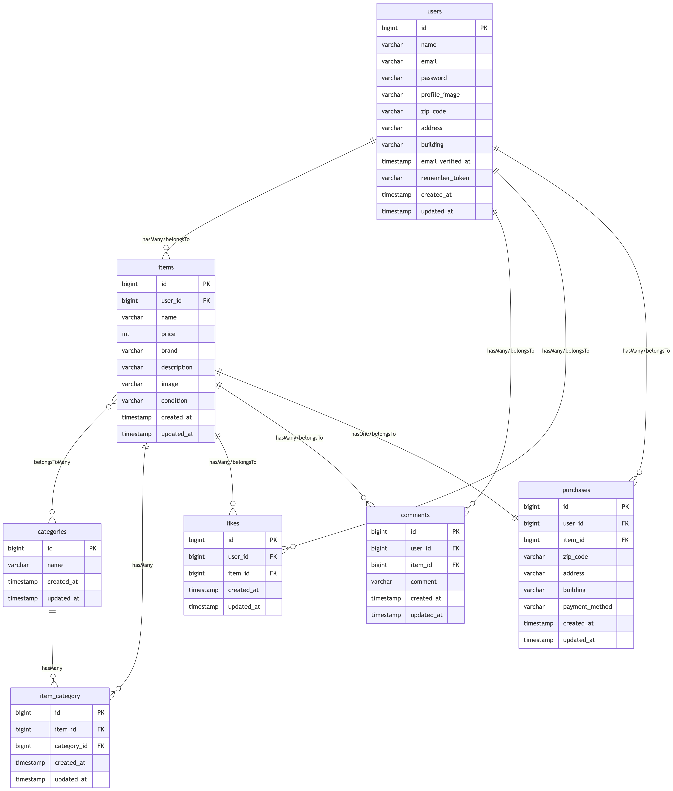

# coachtech-furima

## サービス概要
coachtechフリマは、ある企業が開発した独自のフリマアプリ<br/>
ユーザーが商品の出品・購入を行うことができる

## 環境構築

### Dockerビルド

- `git clone git@github.com:misawayb/coachtech-furima.git`
- `docker-compose up -d --build`<br/>
  Macで linux/arm64 のエラーが表示されてビルドできなかった場合 docker-compose.yml に以下を追記して再度`docker-compose up -d --build`する<br/>
  エラーが出てもビルドできている場合は無視してもOK
  ```
  mysql:
      platform: linux/x86_64
      image: mysql:8.0.26
  ```

### Laravel環境構築

1. `docker-compose exec php bash`
2. `composer install`
3. `cp .env.example .env`
4. envに環境変数が以下になっていることを確認
   ```
   DB_CONNECTION=mysql
   DB_HOST=mysql
   DB_PORT=3306
   DB_DATABASE=coachtech-furima_db
   DB_USERNAME=laravel_user
   DB_PASSWORD=laravel_pass
   ```
5. Stripeのテストキーを env.testing に追加<br/>
   `STRIPE_SECRET=sk_test_xxxxxxxx`<br/>
   StripeのテストキーはStripeダッシュボードのAPI
   keysから取得できる
6. 画像アップロード対応<br/>
   `php artisan storage:link`
7. アプリケーションキー作成<br/>
   `php artisan key:generate`
9. マイグレーション実行<br/>
   `php artisan migrate`
9. シーディング実行<br/>
    `php artisan db:seed`

## 開発環境

- トップ画面（商品一覧）：http://localhost/
- 会員登録：http://localhost/register
- phpMyAdmin：http://localhost:8080

## 使用技術（実行環境）

- PHP 8.5.0
- Laravel Framework 13.3.0
- mysql:8.0
- nginx:1.21.1
- Docker 29.2.1

## ER図



## URL

- MailHog：http://localhost:8025
- Stripe：https://dashboard.stripe.com/

